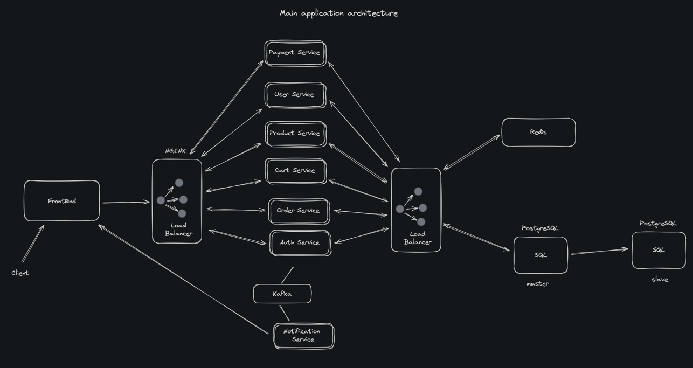

# fastr: online shop

This diagram represents the high-level architecture of a scalable, microservices-based web application. The architecture is designed to provide a robust, fault-tolerant system that can handle high traffic loads and ensure seamless user experience.

## Client Interaction

- FrontEnd: The user interface of the application where clients interact with the application.
- Load Balancer (NGINX): Serves as the entry point to the backend services and distributes incoming network traffic across multiple servers to ensure no single server becomes overwhelmed.

## Core Services

- Payment Service: Handles all payment transactions including validation, processing, and secure storage of payment information.
- User Service: Manages user information, authentication, and authorization.
- Product Service: Maintains product catalog with details such as pricing, descriptions, and availability.
- Cart Service: Manages shopping cart data, providing functions to add or remove items, and checkout.
- Order Service: Processes orders, from creation to completion, ensuring inventory is updated.
- Auth Service: Responsible for authentication and generating tokens for secure communication between services.

## Data Management

- Redis: An in-memory data store used as a distributed cache to improve the performance of the application.
- PostgreSQL (SQL Master-Slave Replication): The primary relational database system with master-slave replication for redundancy and performance. The master database handles writes while the slave database(s) handle read operations.

## Asynchronous Processing & Communication

- Kafka: A distributed streaming platform used for building real-time data pipelines and streaming apps. It is used here to handle messages or events that are produced by various services.
- Notification Service: Sends notifications to users, such as order confirmations or payment receipts.

The architecture aims to decouple services, making it easier to develop, deploy, and scale independently. It leverages a combination of well-known technologies like NGINX for load balancing, Kafka for message streaming, and Redis for caching, to ensure reliability and efficiency.
